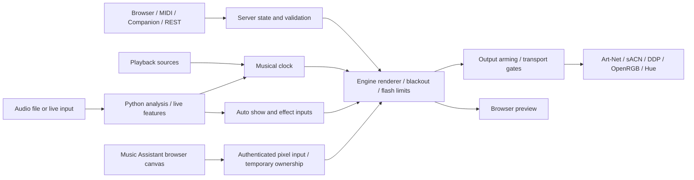

# ArtNet Lightshow

Lighting controller for Art-Net, sACN, WLED/DDP, OpenRGB and Philips Hue
Entertainment. Control it from the browser, MIDI, Bitfocus Companion or REST.
Manual looks, effects, pads and sequences work without Python; analysed shows
and live audio use the optional analysis environment.

## Signal flow



## Setup and deployment

### Source checkout

Use Node.js 24 LTS; Node 22.18 or newer is also supported.

```bash
npm ci
npm start
```

Open **http://localhost:3000**. `npm start` builds the browser client and starts
the server under its supervisor. Complete or skip the first-run wizard; its
controls remain available in Rig, Sources and Settings.

The server always starts **disarmed**, including after a crash or restart.
Previewing still works. Arm from Perform, Settings → Show, Companion, or
`POST /api/outputs/arm` when the rig should transmit. Arming alone does not
start the pattern engine.

### Packaged builds

Download from [Releases](https://github.com/LightD31/artnet-lightshow/releases).
The packages include Node; the analysis environment is installed separately
from the app when needed.

| Package | Start and data location |
|---------|-------------------------|
| Windows installer, `*-win32-x64-setup.exe` | Start menu → ArtNet Lightshow; per-user install in `%LOCALAPPDATA%\Programs\ArtNet Lightshow`, data in `%LOCALAPPDATA%\ArtNet Lightshow` |
| Windows portable, `*-win32-x64.zip` | Run `ArtNet Lightshow.exe`; data in the adjacent `data` folder while the `portable` marker exists |
| Linux archive, `*-linux-x64.tar.gz` | Run `./artnet-lightshow`; portable data as above, otherwise `~/.local/share/artnet-lightshow` |

Closing the server console stops the show. `--version` prints the version.
`--no-supervisor` disables the built-in process supervisor.
`LIGHTSHOW_DATA_DIR` overrides the data location. Updating or uninstalling the
Windows installer leaves the data directory in place.

### Network access

The default bind is `127.0.0.1:3000`. To use another device:

1. In Settings → Server & access, generate an access token and apply it.
2. Set the bind address to `0.0.0.0`, apply, and restart.
3. Visit `http://<server>:3000/?token=<token>` once per browser, or enter the
   token in the access prompt. The browser saves it and removes it from the URL.

A non-loopback bind without a token is rejected both when saving and at
startup. Give integrations the same token in `X-Lightshow-Token`; REST also
accepts `?token=`. Configure **Public URL** when accessing through a custom
hostname or reverse proxy. Cross-origin requests and unrecognised hostnames
are rejected.

An authenticated reverse proxy may overwrite `X-Lightshow-Token` on HTTP and
Socket.IO traffic. Restrict the backend to the proxy and authorised
integrations; forwarded usernames alone do not authenticate a client.

### Upgrade and rollback

Stop the service and copy the **entire config directory** before upgrading:
settings, patch, profiles, cues, MIDI bindings, effects, palettes, pads and
sequences. For the default source-checkout location:

```bash
cp -a config config.pre-engine
```

Use the actual `LIGHTSHOW_CONFIG_DIR` or packaged data directory when it differs.
Preserve the matching application revision or package as well. Update through
the installation's normal release/service path; for a checkout, install the
locked dependencies with `npm ci` and rebuild with `npm run build:client`.
Restart, run preflight, check `/api/health`, and verify the preview while
outputs remain disarmed.

**Before rolling back to a pre-engine build, stop the server and restore its
matching copy of `config/`.** Newer builds migrate or write versioned preset,
pad and sequence data; older builds must not be pointed at those changed
files. Keep the newer config separately if returning to the newer build later.

### Service operation

The built-in supervisor restarts a crashed or unresponsive server. Heartbeats
arrive every second; the timeout is 15 seconds, or 60 during startup. Restart
backoff is 0.5, 1, 2, 5 and 10 seconds; three failures before startup complete
stop retries. Configuration failures exit 78; requested restarts exit 75.

On a supervised restart, `config/look.json` restores the saved look and a
cached auto-show track. Active energy effects are not restored. A normal
start ignores that recovery file, and every start remains disarmed.

For an external service manager that owns restarts, run:

```bash
node server.js --no-supervisor
```

`LIGHTSHOW_SUPERVISOR=0` has the same effect. Without the built-in supervisor,
restart the process through the service manager; `/api/server/restart`
returns 409. If a Deezer ARL is configured, an unsupervised Node process needs
`--openssl-legacy-provider`.

## Views and controls

An **effect** draws the lights. A **look** combines the base effect, colours and fixture
settings. A **pattern** is a reusable sequence of clips. Favourites are quick access
to effects; pad banks launch effects or patterns over the look.

| View | Shortcut | Purpose |
|------|----------|---------|
| Perform | 1 | Arm outputs, pads and Matrix, transport, strobe, blackout, tap, colours and faders |
| Effects | 2 | Effects catalogue and inspector, cues, look colours, fixture overrides and stage preview |
| Auto Show | 3 | Analyse music, choose its source, run the generated show; Timeline tab for rehearsal and edits |
| Sequence | 4 | Create/load sequences; shared transport and recording; lanes, clips and patterns behind Edit |
| Stage | 5 | Monitor the rendered rig in 3D |
| Rig | 6 | Plan, patch, fixture profiles and outputs |
| Sources | 7 | Playback sources, live input, analysis environment and models |
| Settings | 8 | Show behaviour, safety, MIDI, engine and server access |
| Preflight | 9 | Run the pre-show checks |

Hashes open a view directly, such as `/#perform` or `/#rig/outputs`.
Perform opens by default. Old `#manual`, `#timeline` and `#matrix` bookmarks redirect
to Effects, Auto Show → Timeline and Perform → Matrix. The shared transport names
the look, Auto Show or sequence it controls.
The view strip scrolls with its arrow buttons; keyboard arrows, Home and End
work while a view tab is focused.

Header, Perform, Effects and the stage preview share the same status line:
base look, sequence transport, visible voices and palette override. The
highlighted catalogue row identifies the **base**; a sequence or voice may
be above it. Perform and Effects list visible voices with individual Stop
buttons. Stop all voices also clears latched and off-bank effects.

Pads with no custom label use the catalogue name on both Perform and the
command bar. Once, hold and loop are distinct launch modes. Header controls
select theme, screen wake lock and fullscreen for the current device.

## Configuration

Use Rig, Sources and Settings, then **Apply**. `GET /api/settings` reports
settings with secrets blanked, per-secret presence flags and pending restart
keys; `PUT /api/settings` changes selected fields.

| Section | Fields and defaults |
|---------|---------------------|
| `server` | `host: '127.0.0.1'`, `port: 3000`, `token: ''`, `publicUrl: ''` |
| `artnet` | `enabled: true`, `host: '2.255.255.255'`, `port: 6454`, `universe: 0`, `discovery: true`, `sync: false` |
| `sacn` | `enabled: false`, `host: ''` for multicast, `priority: 100`, `sourceName: 'ArtNet Lightshow'`, `universeOffset: 1`, `interface: ''`; stable generated `cid` |
| `hue` | `bridges: []`, `latencyMs: 0`, `strobe: 'flash'`; each paired bridge has an id, address, enabled flag, area and write-only credentials |
| `outputs` | `armed: false`; always reset to false at startup |
| `sources` | `prolink: false`, `smtc: true` |
| `spotify` | Client id, secret, server-written refresh token; optional `proxyBase`; `allowUnverifiedState: false` |
| `deezer` | Optional `arl` cookie |
| `live` | `enabled: false`, `source: 'loopback'`, `device: ''`, `latencyMs: 0`, `autoSync: true`, `director: true` |
| `auto` | `syncOffsetMs: 0`, `setMemory: true` |
| `clock` | `tempoMode: 'auto'` or `'manual'` |
| `audio` | `mode: 'tempo'`, Hue Dynamics master controls, `ldjTrigger: 0.3` |
| `safety` | `photosensitivityAcknowledged: false`, `strobeMaxLatchSec: 60`, `hdFlashIntervalMs: 350`, `flashLimit: false` |
| `strobe` | Palette, rate, clock, background behaviour and brightness; see [Strobe](#strobe) |
| `midi` | `input: ''`, `output: ''`, `clockOutput: ''`, `controlFeedback: true` |
| `engine` | `thread: 'worker'`; `'main'` is available for diagnosis |
| `analysis` | `analyzerTimeoutMs: 600000`, `downloadTimeoutMs: 300000`, `localRoot: ''`, `pythonPath: ''`, `separator: 'demucs'`, `structureModel: 'auto'`, `gpuMemory: 'auto'` |
| `setup` | `completed: false` until the first-run wizard is completed or skipped |

`server.host`, `server.port`, `server.token`, engine thread and the first Deezer
ARL require a restart.
Other settings apply immediately. The UI lists pending restart keys.

### Files and environment

| Location | Contents |
|----------|----------|
| `config/settings.json` | Settings and credentials; gitignored, mode 0600 |
| `config/show.json` | Fixture patch and custom profiles |
| `config/cues.json` | Saved looks |
| `config/midi-map.json` | Custom MIDI map |
| `config/effects.json`, `palettes.json`, `pads.json`, `sequences.json` | Effect library, palettes, pad layout, sequences and reusable patterns |
| `config/look.json` | Supervisor recovery snapshot |
| `cache/` | Analysis cache |
| `logs/` | Structured logs |
| `.venv/` | Managed analysis environment |

The checkout is the default data directory. `LIGHTSHOW_DATA_DIR` moves the
whole data tree; `LIGHTSHOW_CONFIG_DIR`, `LIGHTSHOW_CACHE_DIR` and
`LIGHTSHOW_LOG_DIR` override individual directories. Corrupt or unsupported
JSON store files are moved aside as `.invalid-<timestamp>` and defaults load.
Stored secrets are never returned by the settings API.

A `.env` in the startup directory is still loaded, but old output/source
configuration variables are ignored and named in a startup warning. Use the
settings API or UI for them. Supported environment controls are listed in
[.env.example](.env.example), including `ARTNET_PYTHON`, `DEBUG_MIDI`, log
settings and data paths.

## Rig and outputs

### Patch and placement

A fresh patch has four Cameo ROOT PAR 6 fixtures in 12-channel mode, on
Art-Net universe 0 at addresses 1, 13, 25 and 37.

| Channel | Function | Channel | Function |
|---------|----------|---------|----------|
| 1 | Dimmer | 7 | White |
| 2 | Dimmer fine | 8 | Amber |
| 3 | Strobe | 9 | UV |
| 4 | Red | 10 | Colour macros, held at 0 |
| 5 | Green | 11 | Sound |
| 6 | Blue | 12 | DMX delay |

Rig → Plan & patch adds fixtures, assigns profiles/addresses and places them
on the room plan. Positions use `{ x, y }` percentages. Fixture groups are
`front`, `back`, `room` or `floor`. Bar geometry is `{ length, angle }`:
length 1–100 stage percent, angle −180–180 degrees; `null` restores defaults.
Panel geometry describes its top edge. Positions and geometry are saved.

**Maximum brightness** is a fixture trim, 0–255, applied after looks and
masters; it is not a temporary override. A fixture override can set colour,
dimmer, strobe or blackout. Clear removes the override. Cues capture looks,
not patch changes.

Import GDTF `.gdtf` or Open Fixture Library `.json` profiles through Rig →
Profiles. OFL search can fetch a fixture online. Profiles in use cannot be
deleted. LED profiles use `cells`; `grid` describes a panel. An undriven
channel's nonzero default belongs in `defaults: [{ offset, value }]`.
Use `/api/profiles/bar` to build a bar profile from cell count, channel order,
stride and optional dimmer/strobe channels.

**Identify** selects fixtures or universes for 8 seconds by default, up to
60; 0 or `/api/identify/stop` ends it. Identify may send a temporary test even
while show outputs are disarmed. Removing a cue, fixture or profile offers
Undo for 12 seconds; restore still checks patch conflicts.

### Output protocols

| Output | Addressing | Setup |
|--------|------------|-------|
| Art-Net | UDP 6454, universes from 0 | Broadcast, unicast, or discovered-node routing; optional ArtSync |
| sACN/E1.31 | UDP 5568, universes from 1 | Multicast `239.255.x.y` or unicast; default offset +1 from the patch |
| WLED/DDP | Device host, optional port and LED offset | Discover by mDNS or add by address; dedicated fixture universes |
| OpenRGB | TCP SDK server, default port 6742 | Enable the SDK server, discover devices and add those with direct LED control |
| Hue Entertainment | Bridge and entertainment-area channel | Pair bridge, select area, add its lamps |

Art-Net and sACN can run together. Universe mappings and the selected network
interface are configured under Rig → Outputs. Preflight detects overlapping
patches, output reachability problems and competing sACN sources.

Disarm stops pattern playback and all voices. It sends a dark frame, terminates
sACN streams, stops DDP updates, closes OpenRGB connections and releases Hue
Entertainment sessions. Master blackout keeps the outputs owned and streaming.

### WLED

Find WLEDs on the local network or add a host directly. Adding reads its LED
count, RGB/RGBW layout and panel dimensions; up to 4096 LEDs form one fixture.
Dedicated WLED universes are not also sent on Art-Net or sACN.

**Add each segment** creates separate fixtures. Segment regions must not
overlap. A panel rectangle uses its LED offset and row stride; WLED resolves
its own wiring order. All segments of one device are delivered as one frame.
LEDs outside patched segments keep their previous values.

Removing a fixture or disarming sends darkness and stops updates. WLED resumes
its own effects after its configured realtime timeout. Set its fallback preset
accordingly. Preflight checks reachability and changed LED counts.

### Screen pictures on an LED panel

An external RGB picture can replace the base picture of one patched DDP panel.
The lighting server remains its only sender: fixture wiring, WLED's LED map,
master blackout, brightness trims and hardware limits still apply. Manual
overrides, pad voices and Identify retain priority over the external picture.
Other fixtures continue their existing effects.

The optional `tools/browser-visuals` helper uses Music Assistant's existing
MilkDrop canvas in a dedicated fullscreen Chrome profile. It removes the artwork,
timeline and visual tint, and follows the local Party Visuals on/off switch.
Music Assistant remains the renderer and audio source. OBS is not required.

The default mode only manages the display: it does not read the lightshow token,
connect to the lighting server or claim a fixture. Add `--curtain` to stream the
same canvas to one patched panel. Pixels are downsampled to its logical grid at
no more than 10 frames per second, with centre-cover cropping by default.
Include gaps in the supplied grid dimensions; WLED applies its physical map once.
A sparse curtain displays large shapes and colours rather than fine text.

On Windows with Node 22.18+, install the helper and use the browser launcher from
[party-visuals](https://github.com/tyclab/party-visuals). The launcher creates a
dedicated persistent Chrome profile, waits for the selected TV and supplies an
ephemeral loopback debugging port. The helper accesses only the configured Music
Assistant origin, now-playing route and player. Sign in normally in this profile;
credentials are not passed through the visualizer URL or command arguments.

```powershell
cd tools/browser-visuals
npm.cmd ci --omit=dev
$profile = "$env:LOCALAPPDATA\PartyVisuals\browser-profile"
$url = 'http://10.27.2.42:8095/#/now-playing?player=02%3A01%3Abb%3A12%3A81%3A49&frameless=1'
node cli.js --browser-profile $profile --visualizer-url $url
node cli.js --browser-profile $profile --visualizer-url $url --preview --output curtain-preview.ppm
node cli.js --browser-profile $profile --visualizer-url $url --curtain --fixture 53 --width 68 --height 42
```

These defaults describe GamerTyc's curtain and SHD player. Supply the intended
player URL, fixture and grid for another installation. Preview writes a local PPM
image and never connects to the lightshow. `--fit contain` adds black margins;
`--help` lists all options. The local browser helper uses the existing NodeCG
`wash.on` control for visibility; intensity still applies to the legacy graphics.
An unavailable control endpoint covers the display and releases pixel input.

Curtain mode reads the existing Party Visuals lightshow URL and token-file
reference only in its local process. The lightshow credential never reaches the
browser. Outputs must already be armed, with photosensitivity acknowledged.
Ownership belongs to the authenticated socket; only one sender can claim a panel.
Accepted frames renew its two-second timeout. Disconnect, disarm, missing frames
or explicit release return the panel to its existing effect. The render worker
enforces expiry independently. Frames and ownership are not saved in the show,
and this helper never arms outputs. Ctrl+C or the launcher's stop request releases
ownership cleanly.

Custom senders use the existing authenticated Socket.IO connection, with
`auth: { token, protocol: 2 }`. Each request uses an acknowledgement callback:

| Event | Payload | Successful acknowledgement |
| --- | --- | --- |
| `pixel-input:claim` | `{ fixtureId, width, height }` | `{ ok: true, leaseId, ttlMs: 2000, maxFps: 20, format: 'rgb24', order: 'row-major' }` |
| `pixel-input:frame` | `{ fixtureId, leaseId, data }` | `{ ok: true }` |
| `pixel-input:release` | `{ fixtureId, leaseId }` | `{ ok: true }` |

`data` is a binary `Uint8Array` or Buffer of exactly `width * height * 3` RGB
bytes. A target must be a full, non-zoned RGB DDP grid with at most 4096 cells.
Accepted frames renew the two-second timeout; rejected frames do not. Claims
belong to one socket and cannot survive disconnection or disarm. Rate-limit and
validation errors return `{ ok: false, code, error }`; repeated message flooding
disconnects the sender. Authenticated `GET /api/pixel-input` reports active input
dimensions and remaining time, without exposing ownership keys or pixel data.

Fullscreen Chrome displays the native visualizer directly; the optional curtain
feed reads that same canvas without a desktop capture or OBS process.

### OpenRGB

Each device is a fixture, with one RGB cell per LED, on dedicated universes.
The patch keeps the device name as well as its number so discovery can resolve
renumbered devices. Devices must support a direct LED colour mode.

Disarm or removal sends darkness and closes the connection. OpenRGB has no
realtime timeout: another client/profile must restore the desired hardware
effect. Unavailable PCs generate warnings; other outputs continue.

### Philips Hue

1. Create an entertainment area in the Hue app.
2. In Rig → Outputs → Philips Hue, discover the bridge or enter its address.
3. Press the bridge link button and pair; choose an area.
4. Add the area's lamps to the patch and place them on the plan.

Multiple bridges can stream simultaneously. A bridge supports one active
entertainment stream; stop another sync client before connecting. Pairing keys
are stored as secrets. Disconnect refuses while lamps remain patched unless
`removeFixtures: true` is supplied.

| Profile | Channels |
|---------|----------|
| Generic Lamp | Dimmer, RGB, warm white, cool white, UV |
| Generic White Ambiance Lamp | Dimmer, warm white, cool white |
| Generic White Lamp | Dimmer |

Hue fixtures have no DMX address; their internal universes start at 60000 and
are not sent to DMX outputs. UV is represented as violet, warm white as a warm
tint, cool white as daylight. `hue.latencyMs` delays Art-Net/sACN relative to
Hue; use `/api/hue/sync-test` to compare them.

### Hue flash handling

Hardware admission and rate limits apply to Hue lamps, including software
emulation of strobe-channel requests. Brightness-flash effects use `hue.strobe`
to choose their presentation within those limits:

- `flash` retains hard cuts and the effect's own background glow.
- `pulse` falls over 200 ms to a floor of 40/255, or the effect's own glow.

Authored Hue Dynamics attack/release envelopes are preserved in either mode.
Disco's automatic strobe retains its 200 ms fall on every lamp. The setting
does not rewrite these envelopes. Fixed-output energy effects also remain
exempt from palette override: White Strobe, Blinder, UV Wash and Kill keep
their output; Colour Strobe and Glow follow the override's first colour.

## Looks, palettes and cues

The base `pattern` accepts classic pattern ids or effect-preset ids. Effects filters the catalogue by family/library and supports favourites.
Editing a built-in saves a copy; user presets are editable and deletable.
`GET /api/effects` exposes family parameter schemas and preset metadata.

Base looks, effects and the global override use one palette model and one editor.
The Perform and Effects palette strip selects its destination: **Base** changes
look colours; **Override** replaces palettes across the stage. Fixed white, UV
and blackout energy effects retain their dedicated output.

A palette contains 1–8 `colours`: `#RGB`, `#RRGGBB`, `#RRGGBBWW`,
`#RRGGBBWWAA` or `#RRGGBBWWAAUU`, plus `{ random: true }` slots. Named
`gradients` have ordered stops (`{ at, slot }` or `{ at, colour }`), `rgb`,
`oklch` or `step` interpolation, and optional wrapping. Named `sets` contain
up to four gradient roles; `gradientSet` and `gradientRole` select the active
role. Without authored gradients, effects keep their existing interpolation.

`POST /api/set` accepts `basePalette` and `overridePalette` bodies, or null.
`PUT /api/palette-override` accepts the same body or `{ paletteId }`.
`paletteOverride` and `paletteOverrideId` remain compatible with existing
clients. Old indexed palettes retain their curated 2/3/4-colour variants;
old palette files, presets and cues load without losing colours or Random.
The library offers every built-in and saved palette in either destination.

Random stage slots roll once when selected. Cues snapshot full palette bodies.
A sequence captures the override's colours, gradients and id; stop, unload
or completion restores that snapshot unless a manual palette change takes
over. Editing or deleting the saved palette cannot alter that snapshot.

Save a cue from the current look or supply a `look` explicitly. Recall restores
its pattern/effect, colours, masters, fixture overrides and strobe settings;
it does not save a held strobe as active. Cues can be renamed, reordered,
recaptured and recalled by id or case-insensitive name.

## Voices and pads

A voice plays above the base or sequence. Strobe tier has priority; ordinary
voices use launch order, target specificity and start time. State summaries
include `id`, `source`, `label`, `mode`, `tier`, `kind`, `targets`, `launchSeq`,
`startedAt`, `until`, `hidden` and `spec`.

| Mode | Lifetime |
|------|----------|
| `hold` | Until release, disconnect or a missing renewal for 1.2 seconds |
| `once` | Its requested ms/beats or the preset's duration |
| `latched` | Until stopped; manual strobe-kind voices also obey the latch cap |

There are two banks of eight pads. Each stores
`{ bank, slot, label, accent, content, launch, quantise, targets }`.
`launch` is `once`, `hold` or `loop`; `targets` is `shared` or fixture ids.
`quantise` is beats: 0 launches immediately; a nonzero value waits for its
next grid while a base, voice or sequence is active. Otherwise it starts now.
Default energy and strobe pads launch immediately; other defaults use 0.25.

| Content kind | Result |
|--------------|--------|
| `preset` | A built-in or user preset with an effect spec |
| `pattern` | A saved lane/clip bundle played as one voice |
| `strobe` | Manual strobe while held, using the pad's targets and grid |
| `sequencePattern` | Insert a saved pattern into the loaded sequence |
| `null` | Empty pad; pressing returns 204 |

Saving rejects unknown content and legacy pattern ids without a corresponding
preset. Pattern voices map shared lanes to the pad targets and track lanes to
target fixtures in patch order. Hold and loop repeat the bundle; once plays it
once. Strobe content permits only hold, not once/toggle.

REST, Socket.IO, MIDI `padPress` and Companion share these launch semantics.
Renewal extends only an existing hold. Explicit stop revokes the old token;
it cannot relaunch until released or absent for 1.2 seconds. MIDI holds also
end on port loss; a missing note-off is bounded by the strobe cap for a strobe
pad and five minutes for other pads.

Legacy energy ids remain available: `white-strobe`, `color-strobe`, `blinder`,
`uv-wash`, `kill`, `palette-strobe`. A momentary hold can cover a latched energy
and reveal the latch again on release. Explicit stops clear the latent intent.

### Matrix

Hold up to eight cells. Each contributes a colour to one board voice; equal
colours remain separate touches. Modes are `fireworks`, `flashes`, `pulses`,
`cycle`, `solid`. Cell holds expire without renewal; releasing the final cell
stops the voice. Stop-all or disarm clears the board and pending changes.

### Strobe

| Field | Values/default |
|-------|----------------|
| `palette` | 1–6 RGBWAUV hex colours; white |
| `flashesPerSecond` | Integer 1–5; 2 |
| `continueBetween` | `true`: underlying look between flashes; `false`: black |
| `clock` | `beat` default, or `wall` |
| `brightness` | 0–1 |
| `onMs`, `blackMs` | Fixed at 100 ms each |

Beat clock uses the finest beat division under the configured rate and cycles
colours; wall clock uses seconds and random palette selection. Bursts accept
100–30,000 ms. `/api/strobe/off` stops all manual strobe-kind voices, including
API/pad launches. Latches are capped by `safety.strobeMaxLatchSec`.

## Sequencer

Live sequence status includes `activeClips`, naming the clips currently winning on patched fixtures.

Create a sequence in Sequence, or load one from its shelf. A new sequence has
one shared lane and 4/4 at the current BPM. Edit exposes name, lanes, clips,
mute/solo, pattern insertion and save/duplicate/delete. Deleting a saved
sequence requires confirmation; Unload releases the current sequence.

| Field | Meaning |
|-------|---------|
| `mode` | `arrangement` or `playlist` |
| `lanes` | Up to three shared lanes; at most one track lane per fixture |
| `clips` | `id`, `laneId`, `startBeat`, `lengthBeats`, `loopBeats`, exactly one `presetId`/`effect`, `targets`, `mute` |
| `commands` | Palette, tempo, brightness or goto commands at beats |
| `automation` | Tempo or brightness automation |
| `loop`, `snap`, `timeSignature`, `bpm`, `musicMode` | Loop bounds, grid and timing |
| `options` | `autoplay`, `shuffle`, `randomPaletteOnLoop`, `initialPalette` |

A track clip wins over shared lanes; a later shared lane wins over an earlier
one; later clip start wins within a lane. Solo excludes other lanes and mute
still suppresses a soloed lane. Missing target fixtures receive nothing.
Playlist mode requires one shared lane with non-overlapping chronological rows.

| Transport | Behaviour |
|-----------|-----------|
| Play | Start or resume; runs even while the base engine is stopped |
| Pause | Hold sequence position while selected clips continue looping |
| Stop | Freeze the last base/sequence picture; `blackout=1` freezes black |
| Unload | Release the held picture and return ownership to the base look |
| Next/previous/shuffle/jump/seek | Select another position or clip |
| Resync | Align to beat or bar; 6/8 is three quarter-note beats per bar |

Without a future loop, an arrangement ends at the bar after its final clip or
command. A playlist ends after its last row unless autoplay is off or shuffle
continues selection. Natural completion releases the look and reports `ended`;
the next Play starts from the beginning. Recording can continue beyond that end.

Patterns are reusable lane/clip bundles: capture a range or insert a saved
pattern at a beat. Capturing includes complete intersecting clips and can
expand the returned range. A pattern pad plays the bundle as a voice instead.

Punch recording stages pad launches after count-in. `overdub` adds clips;
`replace` removes whole overlapping clips on the written lanes/fixtures.
Starts/ends snap to the nearest grid, ties away from zero, minimum one quantum.
Empty pads and strobe pads record nothing. Keep validates one transaction;
conflicting edits return 409 and retain the take. Discard changes nothing.
Saving the loaded sequence to the shelf remains a separate action.

A kept take reports `added`, `removed`, `range` and `beyondRange` for removed
clips extending outside the take. State includes transport, beat/bar, lane
selection and recording status; `sequences` and `sequencePatterns` provide the
shelf summaries. The shelf permits 64 saved sequences.

## Safety

`photosensitivityAcknowledged` starts false and persists when acknowledged via
`POST /api/safety/acknowledge`. Until then, rapid-flash presets/voices,
strobes, rapid sequence content and rapid Matrix modes are refused. REST
returns `409 photosensitivity acknowledgement required`; socket commands
return `error-msg`; MIDI/Companion report the refusal. Stop/release remains
available. The Header and Perform acknowledgement indicator opens the warning.

| Control | Scope |
|---------|-------|
| `safety.strobeMaxLatchSec`, default 60 | Maximum manual strobe-kind latch lifetime, regardless of launch route |
| `safety.hdFlashIntervalMs`, default 350 | Per-lamp bright-rise interval for Hue Dynamics Party effects; not Disco or every effect family |
| `safety.flashLimit`, default false | Limit large-area flashing to three flashes per second |
| Master blackout | Darken the show while retaining output ownership |
| Disarm | Darken/release output streams, stop the base and clear voices |

Other rapid loop/latched effects do not inherit the manual strobe cap.
Hue flash/pulse adaptation preserves the exemptions described under
[Hue flash handling](#hue-flash-handling).

## Music, analysis and audio

### Analysis environment

Sources → Analysis environment installs the locked Python environment using
uv and Python 3.12. Select CPU, CUDA (`cu128`) or ROCm. In a checkout, uv must
be on `PATH`; packaged builds include it.

```bash
npm run setup:python
npm run setup:python -- --build cu128
python scripts/download-models.py --list
python scripts/download-models.py
```

Download required model weights before the show via Sources → Analysis models
or the script. Analysis itself does not download missing weights. The managed
environment supplies yt-dlp, Deno and ffmpeg; a tool already on `PATH` takes
precedence. The analysis needs torch; manual control does not.

Analysis settings select Demucs or BS-RoFormer separation, structure model,
GPU memory policy and timeouts. `analysis.pythonPath` selects an interpreter;
`ARTNET_PYTHON` overrides discovery. See
[Audio analysis](docs/audio-analysis.md) for the analysis schema and controls.

The analysis package separates preprocessing, frame features, perceptual bands,
rhythm, structure, dynamics and perception into modules. `events` combines their
results; `pipeline.analyze()` orchestrates offline analysis and `realtime` uses the
same event vocabulary for live input. The show engine combines musical events
with timing, section and feature data to choose and schedule lighting.

`src/analysis/document.schema.json` defines the shared contract. Python validates
pipeline output through `src/analysis/schema.py`; `npm run gen:analysis-types`
generates the TypeScript types. Cached 2.x documents remain readable across minor
versions: fields introduced later are optional and absent from older documents.

### Playback sources

| Source | Setup |
|--------|-------|
| Spotify | Configure client id/secret, then Connect Spotify; session persists |
| Spotify + OS clock | Spotify metadata with the local media-session position |
| PRO DJ LINK | Enable on the CDJs' network |
| OS now playing | Windows SMTC or Linux MPRIS through `busctl`; unavailable on macOS |
| Deezer | Load `browser-extension/` in a Chromium browser; configure server/token |
| Live input | Enable loopback or input capture and select a device |
| Timer | Run an analysed track against local time |

For direct Spotify OAuth, register the callback the server prints, normally
`http://127.0.0.1:3000/auth/spotify/callback`, and authorise in a browser on the
server machine. For a remote tablet, use the configured OAuth proxy. The
optional Deezer ARL enables ISRC-matched downloads; its first configuration
requires restart. Without it, downloads use the search path.

Set-list warming accepts one artist/title per line, explicit track objects,
a Spotify queue or playlist. It prepares analysis ahead of playback. Cache
management is available in Auto Show and through `/api/auto/cache`.

### Clock and sync

Clock priority is Auto Show → playing PRO DJ LINK deck → analysed current
track → live beat → Tap. `clock.tempoMode: 'manual'` disables CDJ/Track/Live
following; the running Auto Show still follows its analysed grid.

Tap, type or nudge temporarily takes tempo by hand until the source changes.
Follow, or `POST /api/tempo/auto`, returns immediately to automatic timing.
BPM accepts 20–300 including fractions. Divisions are 1, 2, 4, 8 and 16.
A playing or paused sequence and active/pending voices keep the free clock
running even with `running: false` for the base.

State `clock` is `{ source, bpm, byHand, beatPos, epoch, at }`, with wall-clock
milliseconds in `at`. Extrapolate as
`beatPos + (now - at) / 60000 * bpm`; reset interpretation on a new `epoch`.
Do not extrapolate a stopped Tap clock with no base, voice or active sequence.

`auto.syncOffsetMs` moves the generated show relative to track position,
−2000 to 2000 ms. Live auto-sync can refine alignment against captured audio;
`live.latencyMs` accounts for the room's audio path. Hue latency separately
delays the DMX outputs to align with Hue lamps.

### Audio modes

| `audio.mode` | Behaviour |
|--------------|-----------|
| `off` | Effects use their own loops without audio triggers |
| `tempo` | Default; musical tempo without live reactive levels |
| `reactive` | Live levels drive reactive, Disco and Visualizer effects |

With no input, reactive effects use their tempo behaviour. Master controls
include sensitivity, smoothing, attack (up to 2 s), release (up to 5 s),
threshold, reactive depth and brightness. `ldjTrigger` defaults to 0.3.
The highest applicable voice, then sequence clip, then base owns each detector;
otherwise configured defaults apply. `/api/audio` reports detector ownership.

## MIDI and Companion

### MIDI

Select input/output ports in Settings → MIDI. Learn binds the next matching
control to an action; parameters such as cue, fixture, bank and slot belong
to that binding. Optional MIDI channel restricts matching. Reset restores the
built-in X-Touch Compact map. Custom maps live in `config/midi-map.json`.

Actions cover transport, tap/tempo mode, patterns, colour slots, palettes,
energy holds, pads (`padPress` with bank/slot), cues, fixture controls and
master/intensity/sync faders. Relative encoders support two's complement and
binary offset. Button/LED feedback follows the mapping.

Motorised fader feedback defaults on; disable `midi.controlFeedback` for an
echoing loopback. Touch sensors do not count as absolute fader values.
`midi.clockOutput` sends 24 pulses per beat plus start/stop on its own port.
`DEBUG_MIDI=1` logs incoming messages.

### Default mapping — Behringer X-Touch Compact

Set the controller to **Standard MIDI mode** (Layer A). The server auto-detects
the first port matching `/x.?touch/i`.

| Control | MIDI | Action |
|---------|------|--------|
| Encoder 1 | CC 10 (relative) | BPM ±1 |
| Encoder 2 | CC 11 (relative) | Master dimmer |
| Encoders 3–6 | CC 12–15 (relative) | Fixture 1–4 dimmer |
| Encoder 7 | CC 16 (relative) | Strobe speed |
| Faders 1–4 | CC 1–4 (absolute) | Fixture 1–4 dimmer |
| Fader 8 | CC 8 (absolute) | Auto-show intensity |
| Fader 9 | CC 9 (absolute) | Master dimmer |
| Encoder push 1 | Note 0 | Tap tempo |
| Encoder push 2 | Note 1 | Toggle blackout |
| Encoder push 3 | Note 2 | Toggle play/stop |
| Encoder push 4–7 | Note 3–6 | Fixture 1–4 blackout |
| Encoder push 8 | Note 7 | Energy override (hold) |
| Button row 1 | Notes 16–23 | Patterns |
| Button row 2 | Notes 24–31 | 2 patterns + Colour A presets 1–6 |

### Bitfocus Companion

Use Companion 4.3+ and the module in `companion-module/`. Install its dependencies,
then place or symlink the module inside the configured Developer modules folder.
Add an ArtNet Lightshow connection with host, port and access token.

Presets cover busking palettes, energy holds, transport, cues, pads, strobe
bursts, generated-show controls, sequence transport and fixture controls. Hold buttons renew until
release; once and loop pads launch once per press. Server catalogs populate
actions and feedback. The module uses Socket.IO protocol 2. See
[installation](companion-module/INSTALL.md) and
[action/feedback reference](companion-module/companion/HELP.md).

## Home Assistant integration surface

Use authenticated REST commands and a sensor polling `/api/state`; the server
requires no Home Assistant-specific transport. Supply `X-Lightshow-Token` and
`Content-Type: application/json` for JSON bodies. Keep GET polling separate
from POST/PUT/DELETE actions.

| Integration function | API/state |
|----------------------|-----------|
| Ownership switch | `POST /api/outputs/arm` and `/disarm`; state `armed` |
| Base playback | `POST /api/play`, `/stop`, `/api/pattern/:id`; state `running`, `pattern` |
| Master | `/api/master/:value`, `/api/blackout/on` or `/off`; `masterDimmer`, `masterBlackout` |
| Palette | `PUT /api/palette-override` with `{ paletteId }`; clear with DELETE; feedback `paletteOverrideId` plus materialised `paletteOverride` |
| Pads | Press/renew/release, toggle or once; `pads.layout`, `pads.lit` |
| Voices | GET/POST/DELETE `/api/voices`; state `voices` |
| Strobe | PUT settings, POST on/off/burst; state `strobe`; burst 100–30,000 ms |
| Sequence | Load/unload and transport routes; state `sequence`, shelf `sequences` |
| Matrix | PUT mode and POST press/release; state `matrix` |
| Audio | GET/PUT `/api/audio`; state `audio`; reactive effects need reactive mode |
| Safety | GET `/api/safety`, explicit POST acknowledgement; state `safety` |
| Availability | `/healthz` for liveness; `/api/health` for diagnostics |

Disarm when releasing the rig to the house. Blackout alone does not release
Hue Entertainment, WLED realtime control or OpenRGB ownership. Every restart
is disarmed; an integration must deliberately re-arm. Surface a 409 safety
refusal to the operator instead of retrying it as an acknowledgement.

## REST API

All endpoints return JSON. When a token is configured, send it as an
`X-Lightshow-Token` header or a `?token=` query parameter.

### State and transport

| Method | Path | Description |
|--------|------|-------------|
| GET | `/api/state` | Full current state (`armed` says whether anything leaves the machine) |
| POST | `/api/set` | Patch state fields (JSON body) |
| POST | `/api/tap` | Tap tempo |
| POST | `/api/play` · `/api/stop` | Start / stop the pattern engine |
| POST | `/api/bpm/:value` | Set BPM (20–300, fractions allowed) |
| POST | `/api/bpm/adjust/:delta` | Nudge BPM |
| POST | `/api/tempo/auto` · `/api/tempo/manual` | Automatic tempo match on (follow the music) or off (keep the tapped or typed BPM); `auto` while on ends a tempo held by hand; answers `{ ok, tempoMode, clock }`, stored across restarts |
| POST | `/api/master/:value` | Master dimmer (0–255) |
| POST | `/api/blackout/toggle` · `/api/blackout/on` · `/api/blackout/off` | Master blackout |
| POST | `/api/pattern/:id` | Set pattern (e.g. `chase`, `rainbow`) or an effect preset as the base look; an unknown id is taken and plays nothing |
| POST | `/api/color/:slot/:index` | Set colour slot `a`–`d` (index 0–23) |
| GET | `/api/palettes` | The unified catalogue and legacy look sizes, plus the selected base |
| POST | `/api/palette/:id` | Write all four slots from a look (`{ size }` — 2, 3 or 4; default 4) |
| POST | `/api/energy/:id` · `/api/energy/off` | Latch an energy override (a voice; a strobe one is a 409 until the photosensitivity acknowledgement) · clear it, and end a latched strobe |

### Effects, palettes and safety

| Method | Path | Description |
|--------|------|-------------|
| GET | `/api/effects` | `{ families, builtin, user, palettes: { builtin, user } }` — every family with its parameter schema, the built-in presets, yours, and both sets of palettes |
| GET | `/api/effects/:id` | One preset (404 `No such effect`) |
| POST | `/api/effects` | Save a preset of your own (201 `{ ok, preset }`) |
| PUT · DELETE | `/api/effects/:id` | Change or delete one of yours; a built-in answers that it cannot be changed (save a copy) |
| POST | `/api/effects/command` | `{ cmd, arg? }` to the effect playing as the base look; answers once the renderer has decided (see [Looks, palettes and cues](#looks-palettes-and-cues)) |
| GET | `/api/palettes/:id` | One palette, built in or yours |
| POST · PUT · DELETE | `/api/palettes` · `/api/palettes/:id` | Save (201), change or delete a palette of your own |
| PUT | `/api/palette-override` | `{ colours: ['#RRGGBB', …] }` (1 to 8) or `{ paletteId }`: override effect palettes (fixed white, UV and blackout energies keep their output); random entries roll once per request; answers `{ ok, paletteOverride }` |
| DELETE | `/api/palette-override` | Remove it |
| GET | `/api/safety` | `{ photosensitivityAcknowledged, hdFlashIntervalMs, strobeMaxLatchSec }` |
| POST | `/api/safety/acknowledge` | Give the photosensitivity acknowledgement (stored) |

### Voices, pads, strobe and the matrix board

A refused effect for want of the acknowledgement answers
`409 photosensitivity acknowledgement required`.

| Method | Path | Description |
|--------|------|-------------|
| GET | `/api/voices` | The running voices |
| POST | `/api/voices` | `{ effect \| preset, targets?, mode?, ms? \| beats? }` — `targets` `shared` or fixture ids, `mode` `once` (default, with `ms` or `beats`) or `latched` (no length); answers `{ ok, id }` |
| DELETE | `/api/voices/:id` · `/api/voices` | Stop one (404 `No such voice`) · all (`{ ok, stopped }`) |
| GET · PUT | `/api/pads` | The layout and the lit pads (`{ layout, lit }`) · a whole layout (`{ pads }`) |
| PUT | `/api/pads/:bank/:slot` | One pad's fields (bank 0–1, slot 0–7) |
| POST | `/api/pads/:bank/:slot/press` · `/renew` · `/release` | Press a pad from REST (`{ token? }` or `?token=`, default `rest`), keep its hold, let it go. `renew` within 1.2 s extends a live hold and never launches (`{ renewed }`, false for a `once`, a `loop` or a hold ended); the same press within 1.2 s also renews a hold |
| POST | `/api/pads/:bank/:slot/toggle` | Start or stop a pad as a loop |
| POST | `/api/pads/:bank/:slot/once` | Fire it once (`?ms=` for a length) |
| GET | `/api/strobe` | `{ active, mode, settings }`, as every strobe route answers |
| PUT | `/api/strobe` | Strobe settings, any of them (see **Strobe**) |
| POST | `/api/strobe/on` · `/api/strobe/off` | Latch (ends at the cap) · stop every strobe voice |
| POST | `/api/strobe/burst/:ms` | One burst, 100–30,000 ms; any other length is a 400 |
| GET | `/api/matrix` | `{ mode, colours, voice }`, as every matrix route answers |
| POST | `/api/matrix/press` · `/api/matrix/release` | `{ colour: '#RRGGBB', token? }` — touch a cell (up to eight at once) · `{ colour }` or `{ token }` — let go |
| PUT | `/api/matrix` | `{ mode }`: `fireworks`, `flashes`, `pulses`, `cycle` or `solid` |

### Sequencer

Transport routes answer `{ ok, status }`; with no sequence loaded they answer
409.

| Method | Path | Description |
|--------|------|-------------|
| GET | `/api/sequence` · `/api/sequence/status` | The loaded sequence, its clip table as the engine plays it (`table`) and its status · the status alone |
| PUT | `/api/sequence` | Load a whole sequence, or `{ id }` of a saved one |
| DELETE | `/api/sequence` | Unload it: nothing is loaded, a running take is dropped, and the look is the rig's base again |
| GET · POST | `/api/sequences` | The saved sequences · save one (201; 409 if the id is taken) |
| GET · PUT · DELETE | `/api/sequences/:id` | One saved sequence |
| POST | `/api/sequence/play` · `pause` · `stop` · `next` · `prev` · `shuffle` | Transport; `stop?blackout=1` (or `{ blackout: true }`) goes black |
| POST | `/api/sequence/seek/:beat` · `/api/sequence/jump/:clipId` | Go to a beat · to a clip |
| POST | `/api/sequence/resync/:boundary` | `beat` or `bar` |
| POST | `/api/sequence/loop` | `{ on, startBeat, endBeat }` |
| GET · POST | `/api/sequence/patterns` | The saved patterns · save one (409 if the id is taken) |
| GET · PUT · DELETE | `/api/sequence/patterns/:id` | One pattern |
| POST | `/api/sequence/insert-pattern` | `{ id, atBeat }` into the loaded sequence |
| POST | `/api/sequence/capture-pattern` | `{ fromBeat, toBeat, laneIds, name }` from the loaded sequence (201) |
| POST | `/api/sequence/record` | `{ mode: 'overdub' \| 'replace', countInBeats?, quantise? }` (0–1024 and 0–64 beats, default 0) — start a take |
| POST | `/api/sequence/record/stop` | `{ keep }` — keep or discard the take; answers `{ ok, added, removed, status }`, and for a kept take that wrote something `range: { fromBeat, toBeat }` and `beyondRange: [{ id, laneId, startBeat, lengthBeats, beforeBeats, afterBeats }]` |

### Audio

| Method | Path | Description |
|--------|------|-------------|
| GET | `/api/audio` | The audio settings, the levels heard and the detectors |
| PUT | `/api/audio` | `{ mode?, master?, ldjTrigger? }` — `master` by field, the rest kept; answers `{ ok, changed, settings, detectors }` |

### Fixtures, profiles and shows

| Method | Path | Description |
|--------|------|-------------|
| POST | `/api/fixture/:id/override` | Set a fixture override (JSON body) |
| POST | `/api/fixture/:id/blackout/toggle` · `/api/fixture/:id/clear` | Per-fixture blackout / clear |
| POST | `/api/fixture/:id/max/:value` | Fixture maximum brightness (0–255) — scales the fixture's output; not an override |
| POST | `/api/fixtures` · DELETE `/api/fixtures/:id` | Add / remove fixtures. With no body, one generic par behind whatever is on the default universe; with `{ profileId?, count?, universe?, address?, label? }`, `count` (up to 64) of that profile one after another, on into the next universe when one fills (a strip on universes of its own); answers `{ fixtures: [ids], placed: [{ universe, address }] }`. A Hue lamp profile is refused: Hue lamps are added with `POST /api/hue/:bridge/add`. DELETE answers with the fixture and its index |
| POST | `/api/fixtures/restore` | Put a deleted fixture back (`{ index, fixture }`) |
| POST | `/api/gdtf/parse` | Parse an uploaded `.gdtf` (multipart `gdtf`) |
| POST | `/api/ofl/parse` | Parse an uploaded Open Fixture Library `.json` (multipart `ofl`, optional `manufacturer`) |
| GET | `/api/ofl/search?q=` | Search the Open Fixture Library online: `{ results: [{ manufacturerKey, fixtureKey, manufacturer, name, categories }] }` |
| GET | `/api/ofl/fixture/:manufacturer/:fixture` | Fetch a fixture from the Open Fixture Library and parse it, as `/api/ofl/parse` answers |
| POST | `/api/profiles` · DELETE `/api/profiles/:id` | Register / remove a fixture profile (`cells` makes it an LED bar, `grid` a panel; `defaults: [{ offset, value }]` holds undriven channels off 0) |
| POST | `/api/profiles/bar` | Build and register an LED bar profile from `{ id, name, cells, firstChannel, order, stride?, dimmer?, strobe? }`; `?dryRun=1` answers with it without registering |
| GET · POST | `/api/show` | Export / import the patch |
| GET | `/api/wled/discover` | Ask the network for WLEDs (mDNS): `{ devices: [{ host, name, leds, rgbw, matrix, version, segments, patched }] }` |
| POST | `/api/wled/add` | Add a WLED to the patch from `{ host, label?, segments? }`: its profile from `/json/info`, on free universes, sent DDP. With `segments: true`, a fixture for each segment in its `/json/state` not patched yet: `{ fixtures, profiles, info, segments }` |
| GET | `/api/openrgb/discover?host=&port=` | Ask an OpenRGB SDK server for its devices: `{ host, port, devices: [{ index, name, type, leds, direct, patched }] }` |
| POST | `/api/openrgb/add` | Add devices of an OpenRGB server to the patch from `{ host, port?, devices?: [index], label? }` — those named, or every one with LEDs not patched yet — each a fixture with a cell per LED, on free universes, sent over the SDK: `{ fixtures, profiles, devices }` |

### Outputs

| Method | Path | Description |
|--------|------|-------------|
| POST | `/api/outputs/arm` · `/api/outputs/disarm` · `/api/outputs/toggle` | Whether anything leaves the machine (`{ armed }` back). Disarm ends every stream — a black frame, the sACN terminate, a dark frame to each WLED, a dark frame to each OpenRGB device and its connection closed, a dark frame and the session closed on each Hue bridge — stops the patterns and clears every voice; arm resumes transmit. Stored as `outputs.armed`, applied at once, always off at start |
| GET | `/api/artnet/nodes` | The Art-Net nodes that answered, with the universes each outputs, and whether frames are being routed by them; `?scan=1` asks the network now |
| GET | `/api/network/interfaces` | This machine's IPv4 addresses and their broadcast addresses, for sACN's network and the Art-Net target |
| POST | `/api/artnet/identify` | `{ address, universes?, seconds? }`: send the node ArtAddress *locate* (and *normal* after), and identify the fixtures on the universes it outputs |
| GET | `/api/sacn/sources` | The other sACN sources heard, and `conflicts`: universes this rig sends that one of them sends too; `?listen=1&seconds=` listens (again) |

### Identify

| Method | Path | Description |
|--------|------|-------------|
| POST | `/api/identify` | `{ fixtures?: [ids], universes?: [n], seconds? }` — those fixtures, and everything on those universes, show themselves for `seconds` (default 8, up to 60; 0 stops). Answers `{ ids, remainingMs }`; the live state carries it as `identify` |
| POST | `/api/identify/stop` | Stop identifying, a streamed WLED or OpenRGB device included |
| POST | `/api/wled/identify` | `{ host, seconds? }`: through the patch when the WLED is in it (`via: 'patch'`), else its picture streamed over DDP (`via: 'device'`) |
| POST | `/api/openrgb/identify` | `{ host, port?, device, seconds? }`: through the patch when the device is in it (`via: 'patch'`), else its picture streamed over the SDK (`via: 'device'`, with `leds` and `name`) and the device put back after |
| POST | `/api/hue/:bridge/identify` | `{ channel, seconds? }`: the lamp on that channel of the bridge's area through the patch (`via: 'fixture'`), else the bridge's own identify (`via: 'bridge'`) |

### Cues

| Method | Path | Description |
|--------|------|-------------|
| GET | `/api/cues` | Every cue, with its full stored look |
| POST | `/api/cues` | Save a cue (`{ name }`, capturing the live look, or `{ name, look }`) |
| PUT | `/api/cues/:id` | Rename (`{ name }`), overwrite from the live look (`{ recapture: true }`), or replace outright (`{ look }`) |
| DELETE | `/api/cues/:id` | Delete a cue |
| POST | `/api/cues/:id/recall` | Put a cue on stage |
| POST | `/api/cues/by-name/:name/recall` | Put the cue with that name on stage (case ignored); 404 when none carries it |
| POST | `/api/cues/restore` | Put a deleted cue back (`{ cue, index }` — what DELETE answered with) |
| POST | `/api/cues/reorder` | Reorder the stack (`{ ids }`); ids left out keep their relative order |

### Auto show

| Method | Path | Description |
|--------|------|-------------|
| POST | `/api/auto/analyze` | Analyse a file path, URL or search query |
| POST | `/api/auto/analyze-spotify` · `-nowplaying` · `-deezer` · `-prolink` | Analyse what's playing on that source |
| POST | `/api/auto/download-analyze` | Analyse a YouTube URL or search |
| POST | `/api/auto/analyze-upload` | Analyse an uploaded audio file (multipart `audio`) |
| POST | `/api/auto/start` · `/api/auto/stop` · `/api/auto/reset` | Playback control |
| POST | `/api/auto/intensity/:value` | Generated-show energy, 0–100 |
| POST | `/api/auto/palette-size/:value` | Colours per song: 2, 3 or 4 |
| POST | `/api/auto/sync-offset/:value` | Light/music sync offset in ms, −2000 to 2000 |
| GET | `/api/auto/state` · `/api/auto/timeline` | Status / generated timeline |
| GET · DELETE | `/api/auto/cache` | List / clear cached analyses |
| DELETE | `/api/auto/cache/entry` | Remove one cached analysis (`{ key }`) |

### Set-list warming

| Method | Path | Description |
|--------|------|-------------|
| GET | `/api/warm` | Progress: per-track status, counts, what is running |
| POST | `/api/warm` | Start a run (`{ text }` — one `Artist - Title` per line — or `{ tracks }`) |
| POST | `/api/warm/spotify-queue` | Warm everything Spotify has queued |
| POST | `/api/warm/spotify-playlist` | Warm a playlist (`{ playlist }` — link, URI or id) |
| DELETE | `/api/warm` | Stop a run, or clear a finished one |

### MIDI, PRO DJ LINK, integrations

| Method | Path | Description |
|--------|------|-------------|
| GET | `/api/midi/ports` | List MIDI ports |
| POST | `/api/midi/connect` | Connect ports `{ input, output }` |
| GET | `/api/midi/map` | The live map, the action catalogue, and whether it is customised |
| PUT | `/api/midi/map` | Replace the whole map |
| POST | `/api/midi/map/reset` | Back to the built-in X-Touch layout |
| PUT | `/api/midi/map/binding` | Bind or clear one message (`{ kind, number, binding }`) |
| POST | `/api/midi/learn` | Arm learn; the request is held open until a control moves |
| POST | `/api/midi/learn/cancel` | Disarm learn |
| POST | `/api/prolink/enable` · `/disable` · `/toggle` | PRO DJ LINK |
| GET | `/api/live/devices` | The audio outputs and inputs the live input can hear, and its capture library |
| GET | `/auth/spotify` · `/auth/spotify/callback` | Spotify OAuth |
| POST | `/api/preflight` | Run the pre-show check against the live subsystems |
| GET | `/api/python/setup` | The analysis environment: whether it is ready, uv, the torch build suggested for this machine, and the setup running |
| POST | `/api/python/setup` · `/api/python/setup/cancel` | Set it up with `{ build }` (`cpu`, `cu128`, `rocm`), and cancel |
| GET | `/api/spotify/now-playing` · POST `/api/spotify/disconnect` | Spotify |
| GET | `/api/spotify/playlists` | The connected account's playlists, for the warming picker |
| POST | `/api/nowplaying/disconnect` | Drop the OS media session source |
| POST | `/api/deezer/state` · `/api/deezer/disconnect` | Used by the browser extension |

### Philips Hue

| Method | Path | Description |
|--------|------|-------------|
| GET | `/api/hue/status` | Every bridge: id, label, address, whether it is on and paired, its area, and what its stream is doing; plus `latencyMs` |
| GET | `/api/hue/discover` | Bridges Philips' cloud service has seen on this network |
| POST | `/api/hue/pair` | Pair with `{ host, label? }` — the bridge link button must have been pressed in the last 30 seconds. Answers `409` with `pressLink: true` if it has not. A new address is added to `hue.bridges` (as `bridge-1`, `bridge-2`…, on, with no area yet); one already there gets fresh keys. Answers the bridge and its areas |
| GET | `/api/hue/:bridge/areas` | Entertainment areas on that bridge, with their channel ids and lamp names |
| GET | `/api/hue/:bridge/lamps` | Its chosen area's channels: each lamp's name, product, devices and what it can show (`kind`: `color`, `ambiance`, `white`, or `null` when the bridge would not say) |
| POST | `/api/hue/:bridge/add` | `{ channels? }`: patch those channels of its area, or every one not in the patch yet, each a fixture on the profile for its `kind`, with `output: { protocol: 'hue', bridge, channel }` and no DMX address |
| POST | `/api/hue/:bridge/disconnect` | Forget that bridge, keys and all. `409` while its lamps are in the patch unless `{ removeFixtures: true }` takes them along |
| POST | `/api/hue/sync-test` | Flash every fixture white once a second for 10 s, to tune `hue.latencyMs` |

`:bridge` is an id from `/api/hue/status`. The routes from before there could
be several bridges — `/api/hue/areas`, `/lamps`, `/add`, `/identify` — still
answer, for the first bridge; `/api/hue/disconnect` does not, since it would
have to guess which. Credentials are never returned by any of these —
`/api/hue/status` reports only whether a pairing exists, and `GET /api/settings`
lists the bridges with their keys blanked. The bridges themselves are ordinary
settings under `hue.bridges`, saved through `PUT /api/settings`: an entry sent
back with blank keys keeps the stored ones, an entry left out is forgotten, and
a file from before several bridges were possible loads its one bridge as
`bridge-1`.

### Settings and models

| Method | Path | Description |
|--------|------|-------------|
| GET | `/api/settings` | Redacted values, secret-presence flags and pending restart keys |
| PUT | `/api/settings` | Update selected settings groups/fields |
| POST | `/api/settings/token/suggest` | Generate a token suggestion; apply it through settings |
| GET | `/api/models` | Model availability and current download job; `?refresh=1` refreshes the listing |
| POST | `/api/models/download` | Download selected models with `{ ids }` |

### The server

| Method | Path | Description |
|--------|------|-------------|
| GET | `/healthz` | Liveness: `{ ok: true }`, no token needed |
| GET | `/api/health` | Status (`ok` / `degraded` / `failing`), problems in words, uptime, engine, main-thread delay, memory, outputs, supervisor — see [diagnostics](#pre-show-checks-and-diagnostics) |
| GET | `/api/logs` | The last log entries: `?after=<seq>` for those after one, `?level=` (`trace`…`fatal`) and `?limit=` (up to 1000); answers `{ last, entries }` |
| POST | `/api/server/restart` | Restart the server under the supervisor (the look comes back); 409 without one |

### Socket.IO

The UI uses Socket.IO rather than polling. Clients send `set`, `override`,
`fixture`, `tap`, `voice-hold`, `energy-hold` and `midi-connect`; the server emits
`auto-position`, `midi-status`, `midi-map`, `midi-learn` and `error-msg`, and
the state in one of two forms, chosen when the client connects:

- **Protocol 2** — asked for with `auth: { protocol: 2 }`; what the live page
  uses. A `snapshot` on connect (`{ protocol, versions, state }`), then
  `patch` events carrying only the keys that changed, grouped by domain (`look`,
  `rig`, `show`, `sources`, `audio`, `sequence`, `catalogs`, `library`,
  `voices`, `pads`, `system`) and numbered per domain:
  `{ d, v, set, del? }`. A client that sees a gap in a domain's numbers sends
  `sync` (with an ack) for a new snapshot. DMX goes out as `dmx-frame`, binary
  (`src/shared/dmx-frame.ts`: per universe its number, its length and its
  bytes), thirty times a second while it changes — volatile, and only to
  clients that sent `subscribe: ['dmx']` (and until `unsubscribe`). The
  `audio` topic works the same way: after `subscribe: ['audio']` the client
  gets `audio` events, volatile, up to thirty a second and only when they
  change — `{ t, party: { full, bass, mid, high }, disco: { gate, level, hit }, spl: { db, level, beat, section, eventT? } }`
  — and `audio` with `null` when the input has gone. Both topics send their
  latest at once on subscribing.
- **Protocol 1** — anything that does not ask, such as the Companion module
  before 2.1: `state` (the full snapshot on connect, the
  whole live state again whenever any of it changes) and `dmx` (channel values
  as JSON, keyed by universe, ten times a second — built only while such a
  client is connected).

The `voice-hold` message holds a voice while a button is down:
`{ action: 'press' | 'renew' | 'release', token, pad?: { bank, slot }, effect?, targets? }`.
`token` (1–64 characters) names the hold; `pad` presses that pad, `effect` is
an effect or `{ preset }` (`{ preset: 'strobe' }` holds the strobe), and the
holder sends `renew` within 1.2 s or the voice dies, as it does when the socket
disconnects. A refusal comes back as `error-msg` with `source: 'voice-hold'`.
`energy-hold` (`{ action, token, effect }`, `effect` an energy override id) is
kept for the Companion module.

The `fixture` message carries
`{ id, address?, universe?, label?, profileId?, maxBrightness?, position?, group?, geometry?, output? }`.
`position` is `{ x, y }` in percent of the stage plot, or `null`; `group` is one
of `front`, `back`, `room`, `floor`, or `null`; `geometry` is an LED bar's line
(a panel's top edge), `{ length, angle }` (length 1–100 in stage percent, angle
−180–180 degrees clockwise on the plot), or `null` for the default; `output` is
`{ protocol: 'ddp', host, port?, at?, rowStride? }` to send the fixture's
universes to a WLED — from its LED `at` for a segment, a row every `rowStride`
LEDs for a rectangle of a panel — `{ protocol: 'openrgb', host, port?, device,
name?, leds }` to send them to device `device` of the OpenRGB SDK server at
`host` (found by `name` when the server has renumbered it), `leds` LEDs long
(as `POST /api/openrgb/add` patches it) — or `null` for
Art-Net and sACN. A Hue lamp's
`{ protocol: 'hue', bridge, channel }` is given by `POST /api/hue/:bridge/add`
and cannot be set or changed here.

## Pre-show checks and diagnostics

Run `npm run preflight` or use the Preflight view. Checks cover patch/output
configuration, Art-Net nodes, sACN conflicts, Hue, WLED/OpenRGB, MIDI, playback
sources, Python imports, models, ffmpeg and download tools. Missing required
models may be downloaded in the background.

| Result | Meaning |
|--------|---------|
| `ok` | Working |
| `warn` | Degraded or unverified; does not fail the run |
| `FAIL` | Will not work; command exits 1 |
| `--` | No check needed |

`/healthz` is an unauthenticated liveness probe. `/api/health` reports
`ok`, `degraded` or `failing`, problems, uptime, engine timing, memory, outputs,
supervisor and effect/voice/sequence counts. Disarmed is informational.

Logs appear in the terminal, the app's Log drawer and `logs/lightshow.log`.
Files are JSON lines, rotated at 10 MB with three retained rotations.
`LOG_LEVEL` changes verbosity; `LOG_FORMAT=pretty|json` controls terminal
format. `/api/logs` supports sequence, level and limit filters.

The UI shows server refusals as toasts and blocks controls while disconnected.
An access-token prompt requires a valid token; ordinary disconnects reconnect
automatically. Use the logs and pending-restart list before changing settings.

## Keyboard shortcuts

Press **?** in the app for this list.

| Key | Action |
|-----|--------|
| **Space** | Tap tempo — also right after clicking a button; a control reached with Tab keeps Space for itself |
| **1** / **2** / **3** | Perform / Effects / Auto Show view |
| **4** / **5** | Sequence / Stage view |
| **6** / **7** / **8** / **9** | Rig / Sources / Settings / Preflight view |
| **←** **→**, **Home** / **End** on the view tabs | Next / previous / first / last view |
| **←** **→** **↑** **↓**, **Home** / **End** | Move within the colour grid |
| **Enter** / **Shift+Enter** | Write the focused swatch into the active slot / the paired slot (A↔B, C↔D) |
| **Shift+click** or **right-click** | Write a swatch into the paired slot |
| **Space** or **Enter** on a pad reached with Tab | Hold: play until released; once: play one phrase; loop: start or stop on each press |
| **←** **→** **↑** **↓** (**Shift** for bigger steps) | Nudge the focused fixture on the stage plot (on the Rig view's plan, the whole selection) |
| **[** **]**, **-** **=**, **0** on a bar | Turn it, change its length, back to its default line |
| **Esc** on the plan | Stop drawing bars; else clear the selection |
| **←** **→** (**Shift** for 10 s), **Home** / **End** on the timeline | Rehearse from a second later / earlier, the start / the end |
| **←** **→** **↑** **↓**, **+** / **−** on the 3D stage | Turn and tilt the view, move closer / further |
| **?** / **Esc** | Show / close the shortcuts overlay |

## Development

```bash
npm run build:client       # build the browser assets
npm run watch:client       # rebuild browser assets on changes
npm run dev                # watch the server, without supervisor
npm run lint
npm run typecheck
npm ci --prefix companion-module # dependency used by Companion tests
node --test --test-concurrency=3 tests/unit/*.test.js
npm run test:e2e
npm run gen:analysis-types # after changing the analysis document schema
npm run package            # package this platform into dist/
```

Server TypeScript runs directly through Node's type stripping. Browser sources
are in `public-src/`; generated `public/app.bundle.js` and chunks are not
committed. Playwright uses a temporary server/config with output disabled;
install its Chromium with `npx playwright install chromium` when needed.

Build packages with Node 24 on the target platform. Package/release workflows
are in `.github/workflows/`; a version tag matching `package.json` drafts the
release. Preserve repository hooks, CI checks and normal release policies.

Python validation uses the analysis environment:
`python -m unittest discover -s tests/python -v`. Optional model and audio
dependencies determine which tests can run; report skips alongside results.
Repository contribution rules and comment-limit approvals live in [AGENTS.md](AGENTS.md).

## Hardware capability and admission

Settings → Hardware limits defines defaults for DMX, DDP, OpenRGB and Hue,
plus named product limits. In Rig, select a fixture to choose its product,
override its flash rate or minimum transition time, and choose its admission
policy. Profile limits sit above technology defaults; a product overrides
those, and an individual fixture overrides the product. Show export, import
and fixture undo retain these fields.

Effects have the same admission choice. When a fixture cannot follow an effect,
**Play at device maximum** slows its clock while preserving the room geometry;
**Hold a value** keeps the first lit value; **Exclude** leaves lower voices or
clips visible (an excluded base is dark). The more restrictive fixture or preset
policy wins. Classic patterns also obey fixture limits; their hold policy uses
a fixed point in the pattern. Existing acknowledgement and photosensitivity
limits remain in force. Perform and the effect inspector show hardware fit;
Preflight reports unverified limits.

Capabilities include the profile's colour channels, pixel count and hardware
strobe range. RGB outputs approximate missing white, amber and UV with visible
RGB. White-only cells continue to respond to their white channels. OFL and
GDTF imports retain numeric physical strobe rates when the driven standard
range has a supported increasing mapping. Unknown or nonnumeric mappings retain
the unverified 1–20 Hz fallback. Software strobes cannot exceed half the render
frame rate; hardware channels use their profile mapping.

Native strobe previews estimate visible pulses from the quantized profile frequency;
their phase is a model prediction, not an optical measurement of the fixture.
Defaults are policy limits, not measurements. A limit is marked measured only
when both measurement evidence and a verified flash rate covering the configured
maximum are supplied at the same override level. The 2026-10-07 curtain census
confirmed full-panel DDP coverage, but its roughly 10 Hz live-view capture cannot
verify visible flashing at 10–20 Hz. Physical optical calibration remains separate.


## Licence

MIT — see [LICENSE](LICENSE).
