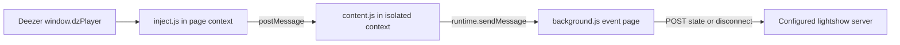

# Lightshow Deezer Bridge (Firefox)

Feeds the **Deezer** auto-source by reading the web player's page state and
posting it to the lightshow server:

- current track **with ISRC** → exact-audio download via Deezer ARL
- **position + play/pause** → drives the auto-show timeline
- **upcoming queue** → prefetches the next tracks' analyses

The generic OS now-playing source (SMTC) stays separate and handles every other
player; when Deezer plays in the browser, this source outranks it.

## How it fits together



## Install (temporary, recommended for dev)

1. Start the lightshow server (`npm start`, default port 3000).
2. Open `about:debugging#/runtime/this-firefox`.
3. **Load Temporary Add-on…** → pick `browser-extension/manifest.json`.
4. Open <https://www.deezer.com> and play a track. The Auto Show panel should
   show `Deezer: ARTIST — TITLE (+N queued)`.

If nothing arrives, open the add-on's own console from that same
`about:debugging` page — under MV3 the background page is unloaded when idle,
so it will often show as inactive until a message wakes it. That is normal.

Temporary add-ons unload on browser restart. For a permanent install, sign it
via [AMO](https://addons.mozilla.org) or use Firefox Developer/ESR with
`xpinstall.signatures.required = false` in `about:config`.

## Settings

Open the add-on's **Preferences** (about:addons → this extension → Preferences)
to set:

- **Lightshow server** — host and port, if you don't run it on
  `localhost:3000`. Pointing it at a non-loopback address asks for an extra host
  permission at save time; the manifest only grants loopback by default.
- **Access token** — needed only when the server has one, which it must
  whenever it is bound to anything but localhost. Copy it from the server's
  app, *Settings → Server & access → Access Token*.

Both are stored in `browser.storage.local`. No editing of source files needed.

## Manifest version

**Manifest V3**, requiring **Firefox 142+**.

Firefox MV3 uses a non-persistent **event page** for the background script, not
the service worker Chrome requires — so `background.scripts` stays, and two
things follow that the code depends on:

- the `runtime.onMessage` listener is registered synchronously at the top level,
  which is what lets the browser wake the page when a message arrives;
- the listener **returns** the POST promise, so the page is kept alive until the
  request settles. A fire-and-forget `fetch()` can be killed when the page goes
  idle.

Other MV3 changes: host permissions moved to `host_permissions` /
`optional_host_permissions`, and `web_accessible_resources` is now a list of
objects with an explicit `matches` list rather than bare filenames.

The floor of 142 comes from `data_collection_permissions`, which the add-on
declares (it transmits what you are playing to a server) and which needs
Firefox 140 on desktop and 142 on Android.

Validated with `web-ext lint` (0 errors, 0 warnings, 0 notices) and
`web-ext build`. **It has not been loaded into a running Firefox against a live
Deezer session** — if track detection misbehaves after this upgrade, that is the
first thing to check.

## If it stops detecting tracks (dzPlayer changed)

`window.dzPlayer` is undocumented and Deezer changes it. To rediscover the
shape, open Deezer, press F12 → Console, and run:

```js
dzPlayer.getCurrentSong()          // current track object (SNG_TITLE, ART_NAME, ISRC, DURATION, ALB_PICTURE)
dzPlayer.getTrackList()            // the queue (array of full song objects)
dzPlayer.getIndexSong()            // index of the current track within getTrackList()
dzPlayer.getNextSong()             // immediate next track (depth-1 prefetch fallback)
dzPlayer.getPosition()             // current position — confirm it's seconds (we ×1000)
Object.keys(dzPlayer).filter(k => /queue|song|index|pos|track|next/i.test(k))   // rediscover if renamed
```

Then update the accessor lists in `inject.js` (`readTrackList`, `queueIndex`,
`readUpcoming`) and the field mapping in `toTrack`.

### Notes

- The accessors currently used include `getTrackList()`, `getIndexSong()` and
  `getNextSong()`. Recheck them against the live player when detection fails.
- Position is read once a second and interpolated server-side, same as the
  other sources.
